## Docker tutorials

### 1.Docker应用组成

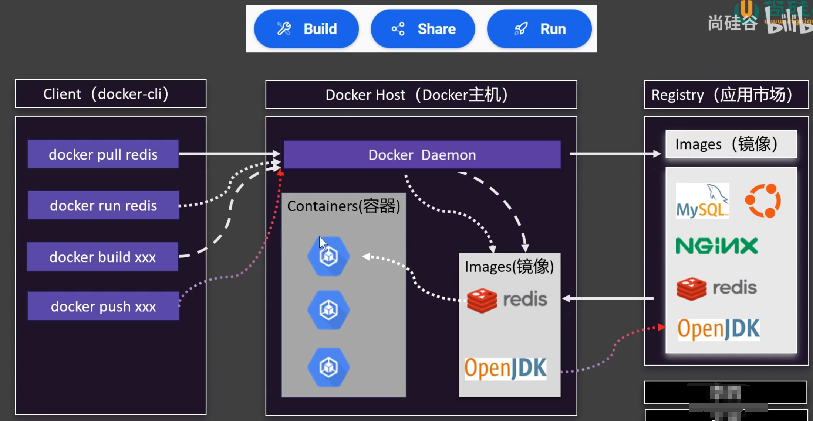

### 2.理解容器

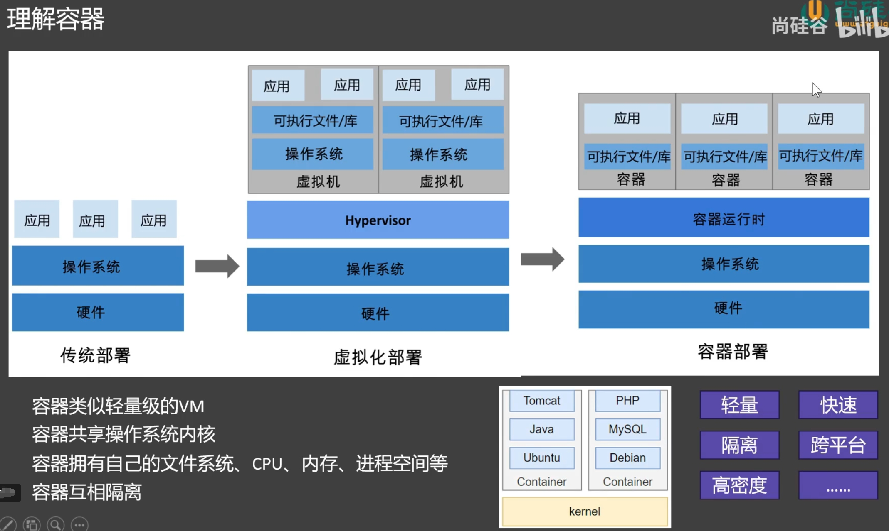

### 3.下载镜像

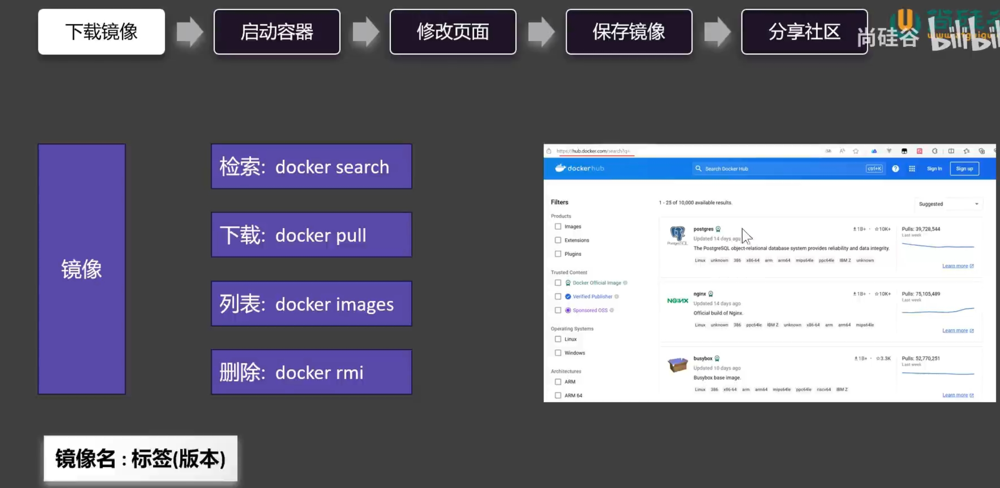

### 4.run命令

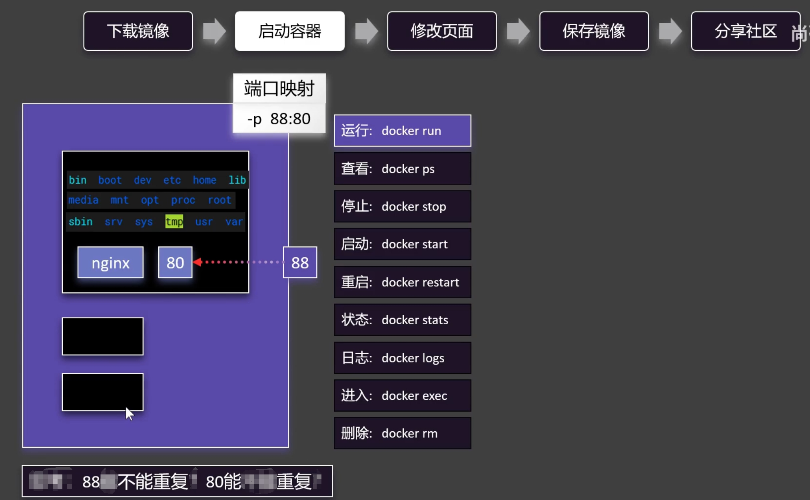

### 5.exec命令

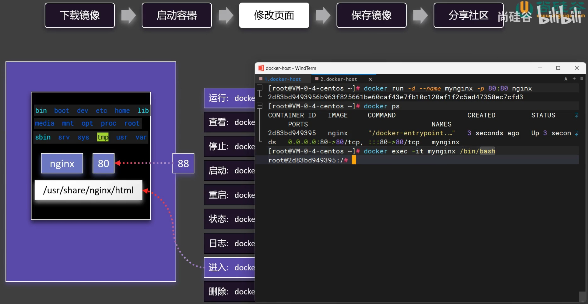

### 6.打包镜像

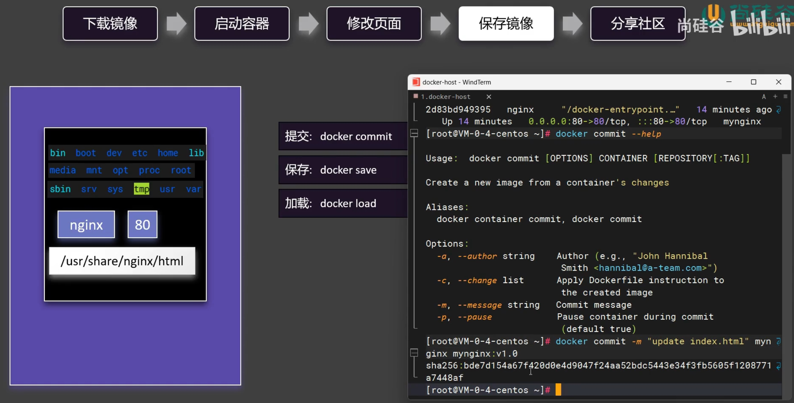

### 7.上传镜像

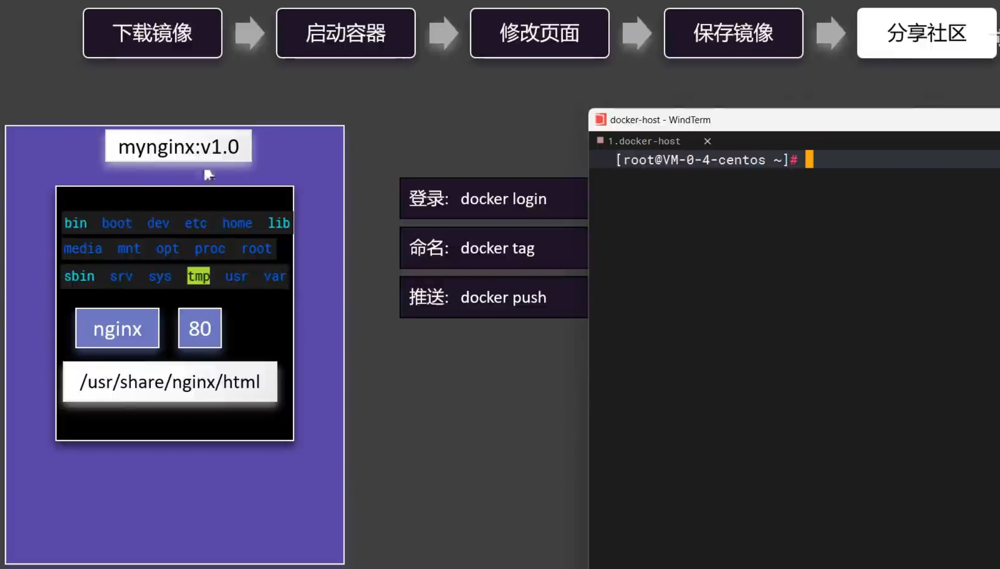

### 8.目录挂载(若宿主机不存在目录则新建)

.png)

### 9.卷映射(若宿主机不存在目录则以容器为准)

.png)

### 10.自定义网络

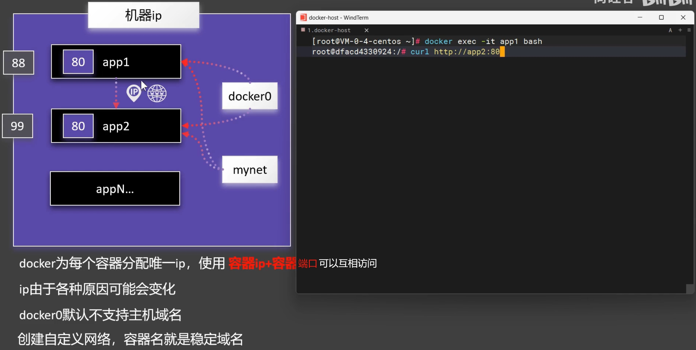

### 11.Redis主从同步集群

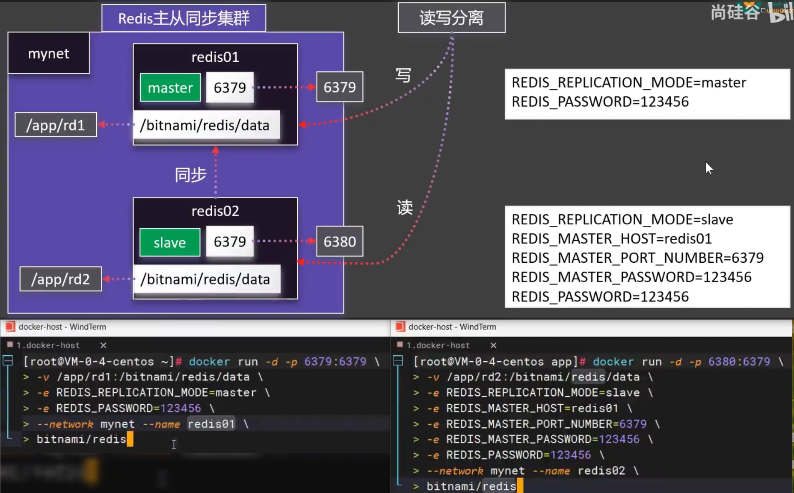

### 12.实践关注点

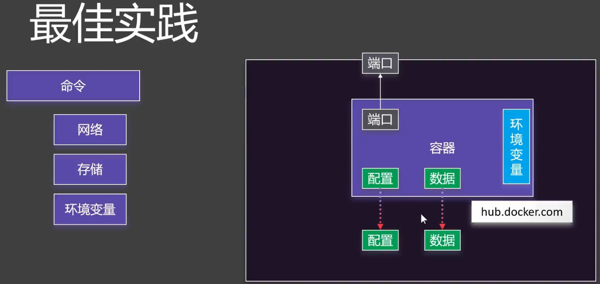

### 13.DockerCompose

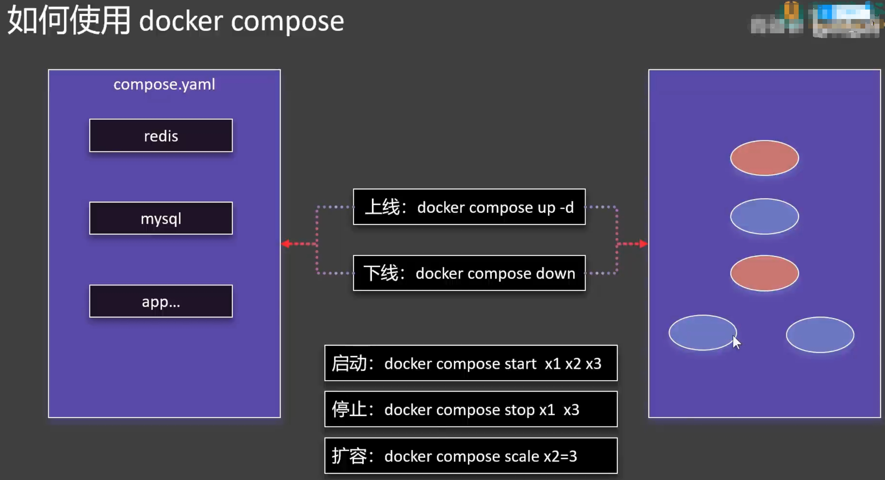

### 14.compose.yaml文件

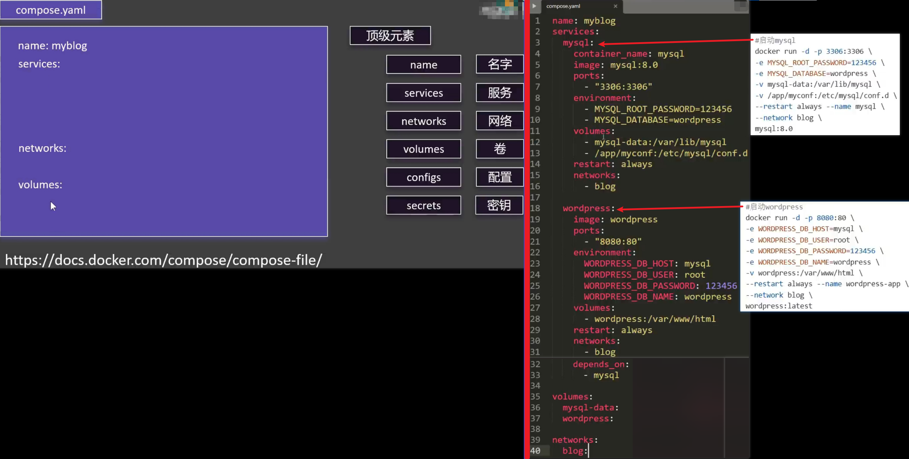

### 15.理解Dockerfile

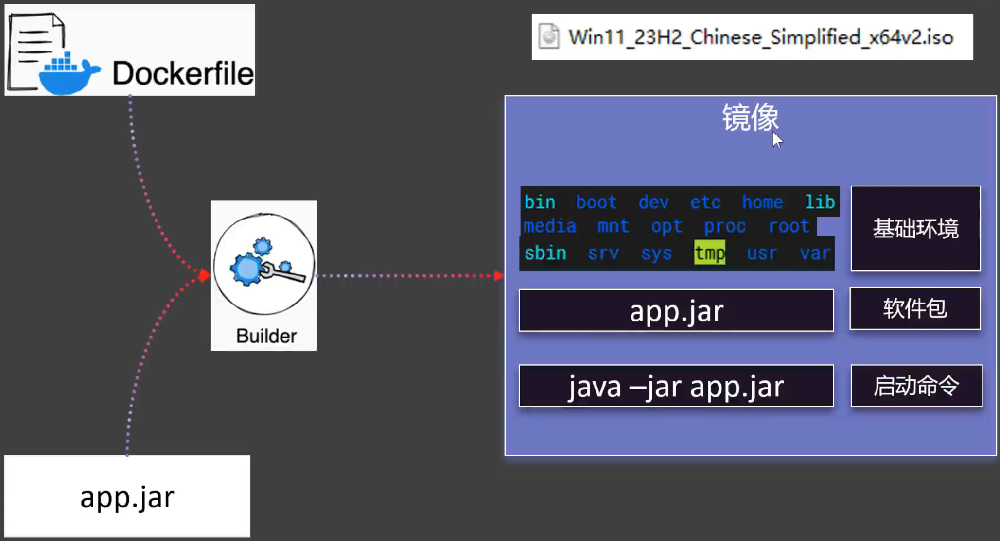

### 16.编写Dockerfile

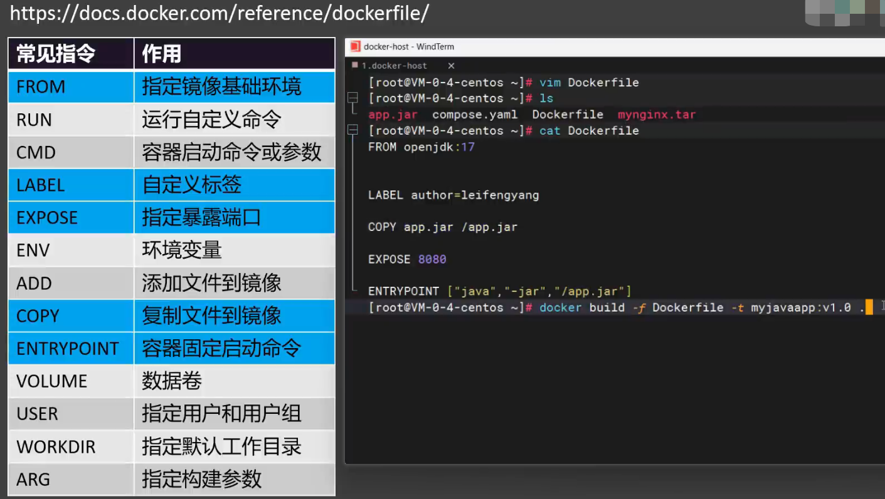

### 17.镜像分层机制

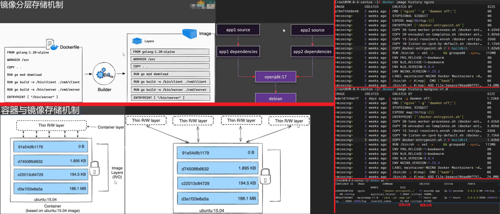

### 18.总结

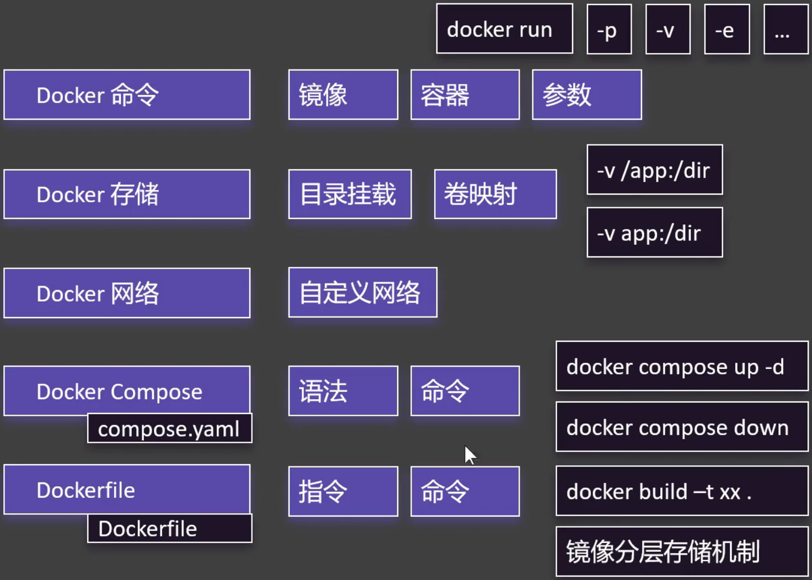

